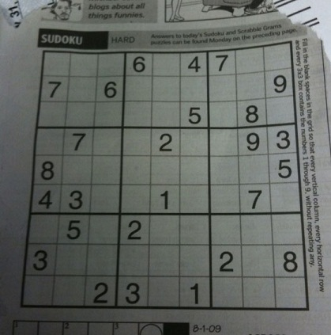
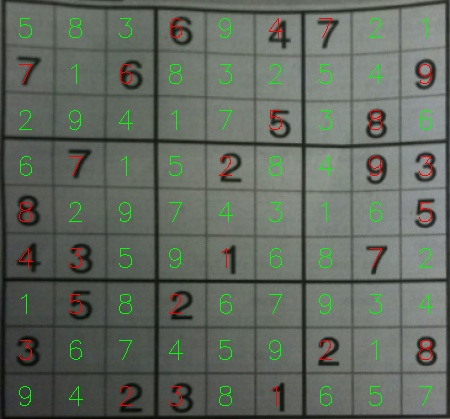

sudoku-terminator
----

### demo
 

### usage
1. prepare virtual env `pipenv install`
2. run solver `python app.py --image-path=examples/sudoku_puzzle.jpg`

### thanks
1. pyimagesearch.com for image processing
2. [PaddleOCR](https://github.com/PaddlePaddle/PaddleOCR) for ocr
