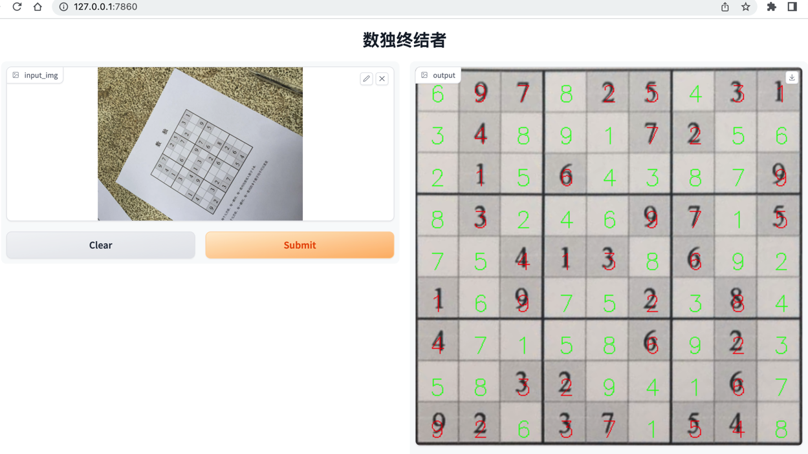

sudoku-terminator
----

### demo

### usage
1. prepare virtual env `pipenv install`
2. run solver `python web.py`. it might take a long time for the first run

### thanks
1. pyimagesearch.com for image processing
2. [PaddleOCR](https://github.com/PaddlePaddle/PaddleOCR) for ocr
